[](https://github.com/TheAlgorithms/Python/blob/master/CONTRIBUTING.md)

## 介绍

- 邮箱：

   gaofeng_zgf@163.com
   
- 编译：

  Markdown编辑器使用[Typora](https://typora.io/)

  主题使用[Drake](https://theme.typora.io/theme/Drake/)

- 其他链接：

  [菜鸟学习Python-从入门到跑路](https://github.com/Nicolas-gaofeng/Salute_Python)

  [菜鸟学习Git-从入门到跑路](https://github.com/Nicolas-gaofeng/Salute_Git)

  [菜鸟学习算法-从入门到跑路](https://github.com/Nicolas-gaofeng/Salute_Algorithm)

  [菜鸟学习机器学习-从入门到跑路](https://github.com/Nicolas-gaofeng/Salute_Machine_Learning)

  [菜鸟学习深度学习-从入门到跑路](https://github.com/Nicolas-gaofeng/Salute_Deep_Learning)

  [菜鸟学习知识图谱-从入门到跑路](https://github.com/Nicolas-gaofeng/Salute_Knowledge_Graph)

  [菜鸟学习数学-从入门到跑路](https://github.com/Nicolas-gaofeng/Salute_Math)

- 个人声明：

  这是一份学习Java的菜鸟教程-从入门到跑路。

  如果本仓库存在的内容对您和您的利益产生损害，请立即私信我们，我们将在最短时间内对其做出删除处理。

  大家有问题，欢迎与我交流、分享，我期待你的来电！

- 鸣谢：

  如果文中出现错误，请与我联系。如果建议或提议十分不错，予以采纳，我将给予适当的物质奖励，并将你纳入贡献者名单！提出小错误或小的建议也是OK的哦，也会纳入名单的哦！期待你的来信！

## 目录

* [介绍](#介绍)
* [目录](#目录)
* [下载与安装](#下载与安装)

## 一、Java概述

### 1.1 Java语言发展史

- 语言：人与人交流沟通的表达方式
- 计算机语言：人与计算机之间进行信息交流沟通的一种特殊语言
- Java语言是美国Sun公司（Stanford University Network）在1995年推出的计算机语言
  Java之父：詹姆斯·高斯林（James Gosling）


- 2009年，Sun公司被甲骨文公司收购，所以我们现在访问oracle官网即可：https://www.oracle.com

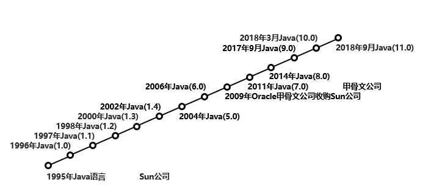

### 1.2 Java语言跨平台原理

平台指的是操作系统

- Windows
- Mac
- Linux

Java程序并非是直接运行的，Java编译器将Java源程序编译成与平台无关的字节码文件(class文件)，然后由Java虚拟机（JVM）对字节码文件解释执行。所以在不同的操作系统下，只需安装不同的Java虚拟机即可实现java程序的跨平台。

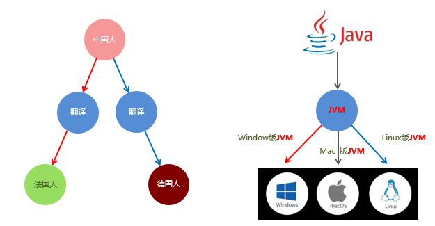

### 1.3 JRE和JDK

- `JVM`（Java Virtual Machine），Java虚拟机
- `JRE`（Java Runtime Environment），Java运行环境，包含了JVM和Java的核心类库（Java API），我们想要运行一个已有的Java程序，那么只需安装 JRE 即可。 
- `JDK`（Java Development Kit）称为Java开发工具，包含了JRE和开发工具，其中的开发工具：编译工具（javac.exe）和运行工具（java.exe）。我们想要开发一个全新的Java程序，那么必须安装 JDK。

JDK、JRE和JVM的关系：

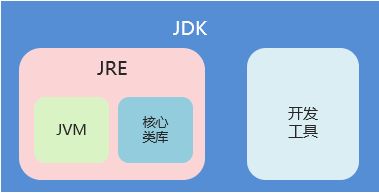

**总结：**

我们只需安装JDK即可，它包含了java的运行环境和虚拟机。

### 1.4 JDK的下载和安装

下面以Windows10系统下的JDK下载和安装为例进行说明。

#### 1.4.1 下载

- 通过官方网站获取JDK http://www.oracle.com
- 注意：针对不同的操作系统，需要下载对应版本的JDK。

在首页点击Downloads，进入oracle软件下载页。


在下载页面，点击Java。


选择Java (JDK) for Developers，点击。


在 Java SE Downloads 页面，点击中间的DOWNLOAD按钮。

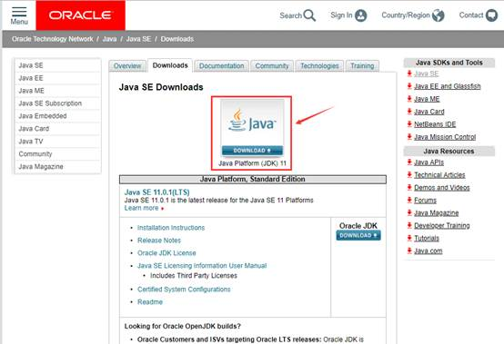

在JDK下载页，首先勾选Accept License Agreement，同意Oracle Java SE的Oracle技术网许可协议。

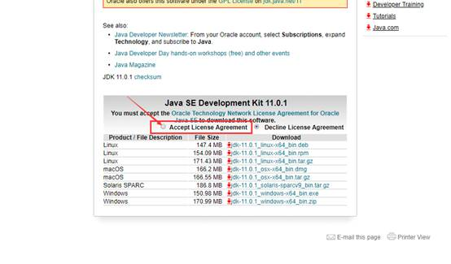

最后，根据操作系统选择合适的版本下载，我们选择Windows系统64位版本，exe是安装程序，点击下载即可。

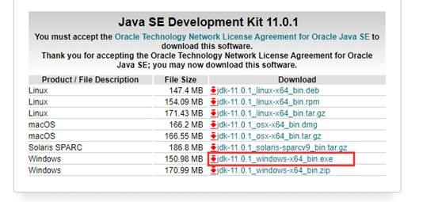

#### 1.4.2 安装

- 傻瓜式安装，下一步即可。但默认的安装路径是在C:\Program Files下，
- 注意：安装路径不要包含中文或者空格等特殊字符（使用纯英文目录）。

首先双击打开安装程序，点击下一步。

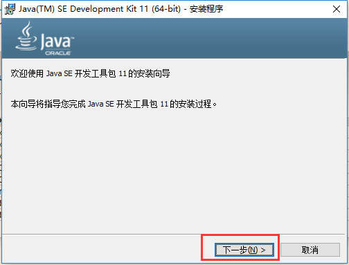

默认安装目录为C盘，点击更改，修改安装路径。

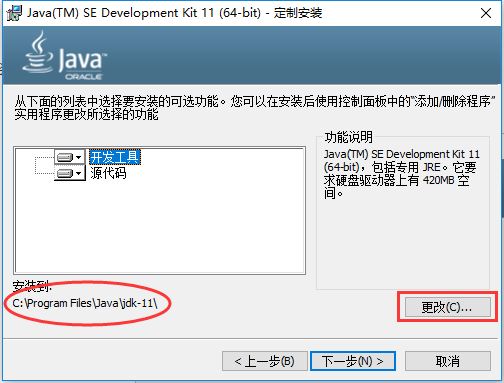

将目录更改至E:\develop，要注意不要修改后面的Java\jdk-11\目录结构。点击确定，进入下一步。

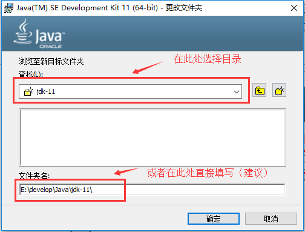

点击下一步，开始安装。

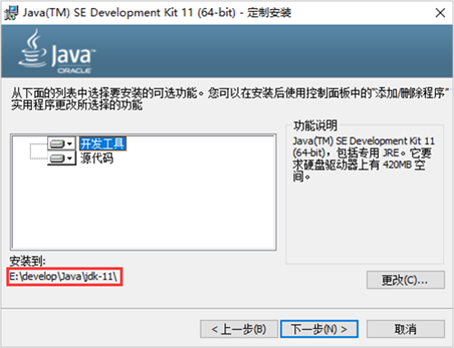

看到安装成功界面，点击关闭，完成安装。

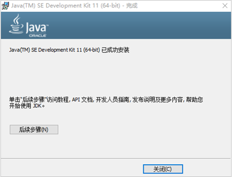

- JDK的安装目录介绍

| 目录名称 |                             说明                             |
| :------: | :----------------------------------------------------------: |
|   bin    | 该路径下存放了JDK的各种工具命令。javac和java就放在这个目录。 |
|   conf   |              该路径下存放了JDK的相关配置文件。               |
| include  |             该路径下存放了一些平台特定的头文件。             |
|  jmods   |                该路径下存放了JDK的各种模块。                 |
|  legal   |             该路径下存放了JDK各模块的授权文档。              |
|   lib    |            该路径下存放了JDK工具的一些补充JAR包。            |

### 1.5 常用DOS命令

在接触集成开发环境之前，我们需要使用命令行窗口对java程序进行编译和运行，所以需要知道一些常用DOS命令。
1、打开命令行窗口的方式：win + r打开运行窗口，输入cmd，回车。

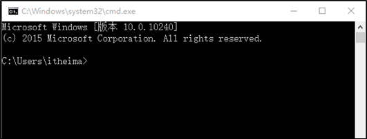

2、常用命令及其作用

|        操作        |               说明                |
| :----------------: | :-------------------------------: |
|     盘符名称:      | 盘符切换。E:回车，表示切换到E盘。 |
|        dir         |      查看当前路径下的内容。       |
|      cd 目录       |     进入单级目录。cd itheima      |
|       cd ..        |        回退到上一级目录。         |
| cd 目录1\目录2\... |  进入多级目录。cd itheima\JavaSE  |
|        cd \        |         回退到盘符目录。          |
|        cls         |              清屏。               |
|        exit        |       退出命令提示符窗口。        |

### 1.6 Path环境变量的配置

#### 1.6.1 为什么配置环境变量

开发Java程序，需要使用JDK提供的开发工具（比如javac.exe、java.exe等命令），而这些工具在JDK的安装目录的bin目录下，如果不配置环境变量，那么这些命令只可以在该目录下执行。我们不可能把所有的java文件都放到JDK的bin目录下，所以配置环境变量的作用就是可以使bin目录下的java相关命令可以在任意目录下使用。

#### 1.6.2 配置环境变量步骤

下面以Windows10系统下的Java环境变量配置为例进行说明。

1、 右键点击“此电脑”，选择“属性”项。

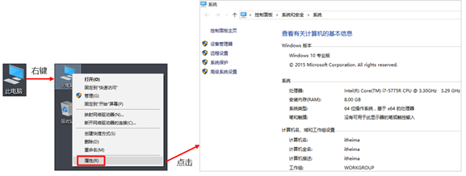

2、 点击“高级系统设置”，在弹出的系统属性框中，选择“高级”选项卡（默认即显示该选项卡），点击“环境变量”。

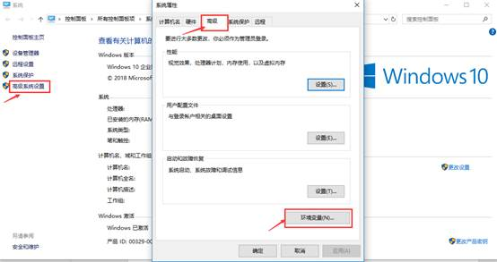

3、 在弹出的“环境变量”框，中选择下方的系统变量，点击新建。

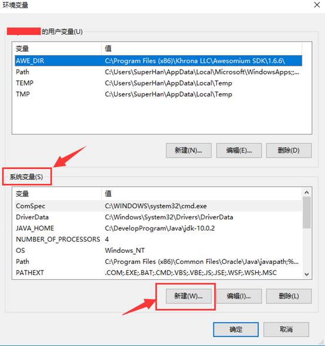

4、 在弹出的“新建系统变量”框中，输入变量名和变量值，点击确定。

变量名为：JAVA_HOME

变量值为JDK的安装路径，到bin目录的上一层即可。比如E:\develop\Java\jdk-11

注意：为防止路径输入错误，可以打开文件夹，拷贝路径。

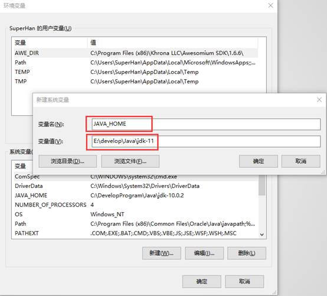

点击确定后，系统变量中会出现一条新的记录。


5、 然后选中“系统变量”中的“Path”变量，点击“编辑”按钮，将刚才创建的JAVA_HOME变量添加到“Path”变量中。

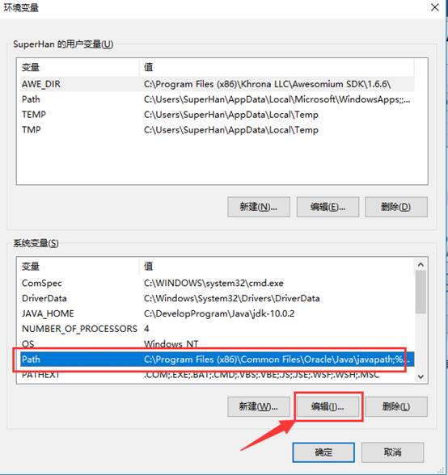

在弹出的“编辑系统变量”框中，点击“新建”，输入%JAVA_HOME%\bin。

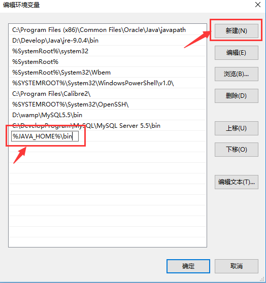

输入完毕，点击“上移”按钮，将该值移动到第一行。点击确定。

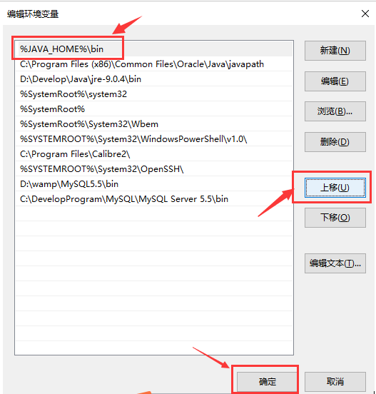

6、 至此，java环境变量配置完毕，打开命令行窗口，验证配置是否成功。

如果之前已经打开命令行窗口，需要关闭重新启动才可。在非JDK安装的bin目录下，输入java或者javac命令，查看效果。

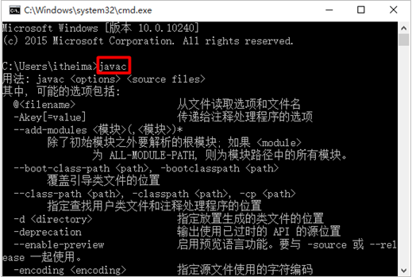

### 1.7 Java程序开发运行流程

开发Java程序，需要三个步骤：编写程序，编译程序，运行程序。

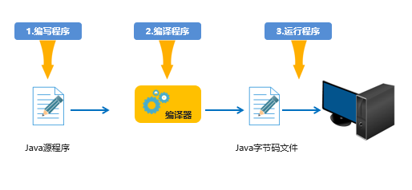

### 1.8 计算机存储单元

我们知道计算机是可以用来存储数据的，但是无论是内存还是硬盘，计算机存储设备的最小信息单元叫" 位（bit）"，我们又称之为"比特位"，通常用小写的字母"b"表示。而计算机中最基本的存储单元叫"字节（byte）"，通常用大写字母"B"表示，字节是由连续的8个位组成。
除了字节外还有一些常用的存储单位，其换算单位如下：
1B（字节） = 8bit
1KB = 1024B
1MB = 1024KB
1GB = 1024MB
1TB = 1024GB

### 1.9 IDEA

#### 1.9.1 IDEA概述

IDEA全称IntelliJ IDEA，是用于Java语言开发的集成环境，它是业界公认的目前用于Java程序开发最好的工具。

集成环境：把代码编写，编译，执行，调试等多种功能综合到一起的开发工具。


#### 1.9.2 IDEA的下载和安装

下载：https://www.jetbrains.com/idea/

安装：傻瓜式安装，建议修改安装路径。

1. 欢迎界面


2. 选择安装路径

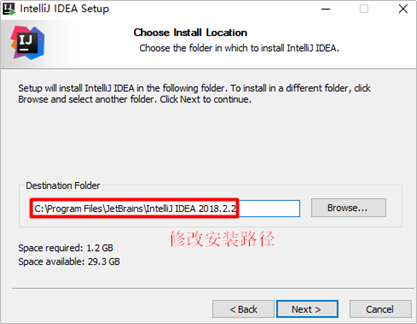

3. 配置安装选项

桌面快捷方式，选中64位的，因为我们的JDK是64位的，JDK9之后不再提供32位的支持

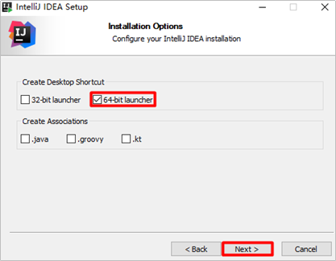

4. 开始菜单

选中一个开始菜单中的名字，我们默认即可。选择install开始安装。安装过程，由于电脑配置不同，这个过程可能需要等待一会

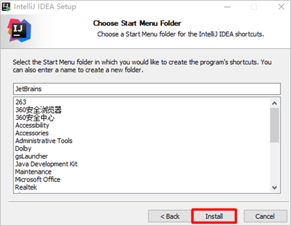

5. 安装完毕


#### 

#### 1.9.3 IDEA启动的基本配置

1. 启动idea，选择不导入任何设置，点击 OK 

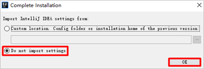

2. 选择主题，左侧的背景是黑色的，后边的是白色，根据自己变成习惯就可以了

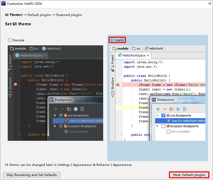

3. 选择哪些功能开启，哪些关闭。我们默认即可。然后点击下一步

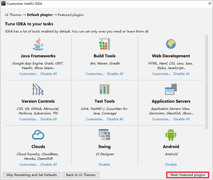

4. 插件的安装

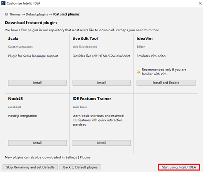

5. idea是收费的，这里要输入激活的信息，这里我们选择免费试用，然后继续


6. 到此idea的启动的基本配置我们就做完了。


#### 1.9.4 IDEA中的HelloWorld

1. 创建一个空项目(JavaSE_Code)

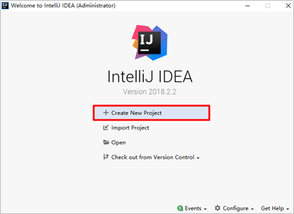


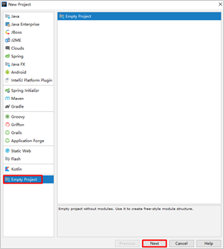


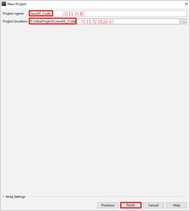


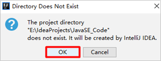

2. 创建一个新模块(idea_test)

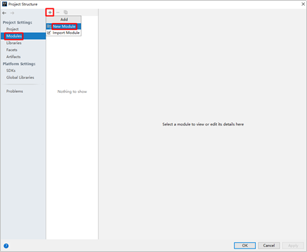


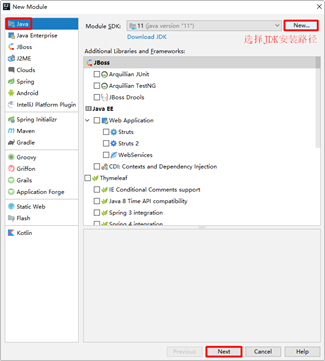


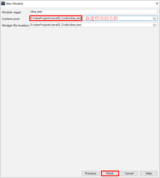


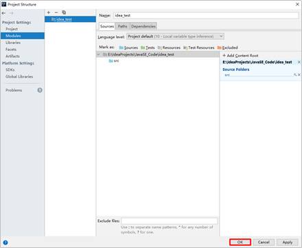

到这模块的创建就完成了，说一下模块下来的两个内容：

src:将来Java程序的代码就存储在这个目录

idea_test.iml

iml文件:是idea自动创建的模块文件，存储着当前模块的一些配置信息。

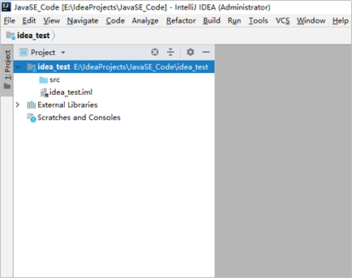

4. 接着来在模块下的src中创建包，在idea_test模块下的src下创建一个包(com.itheima)

   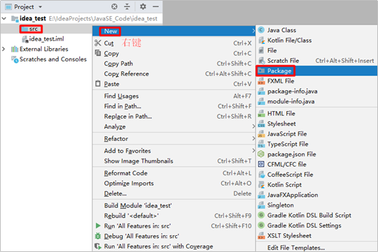

   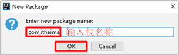

5. 在com.itheima包下新建一个类(HelloWorld)

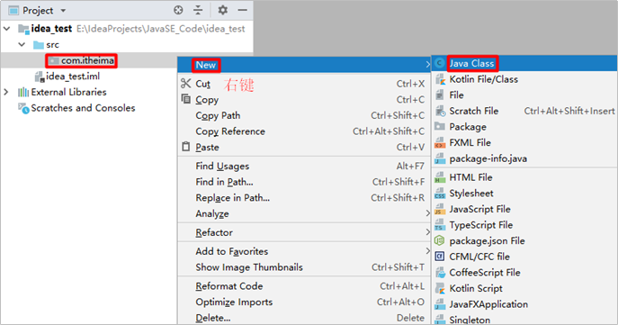

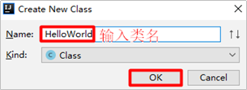

5. 在HelloWorld类中编写代码

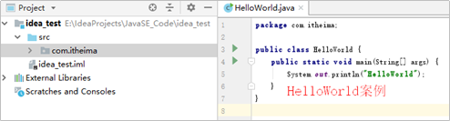

6. 在idea中执行程序

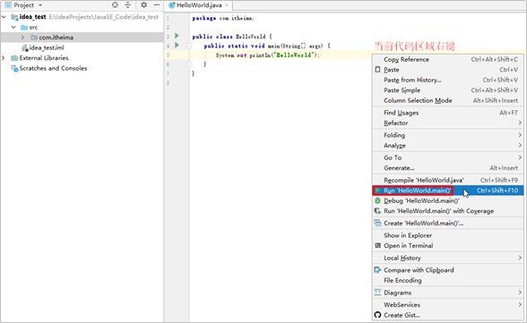

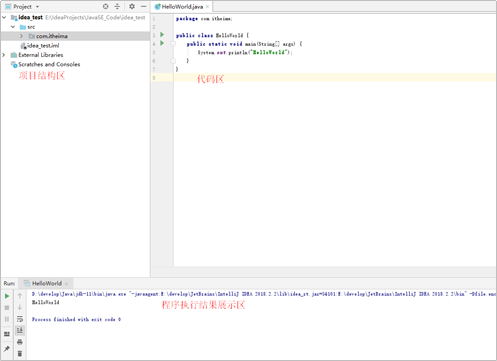

#### 1.9.5 IDEA中项目结构

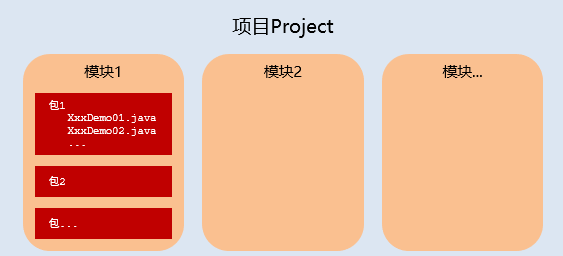

#### 1.9.6 IDEA中内容辅助键和快捷键

##### 1.9.6.1 内容辅助键

- 快速生成语句

   快速生成main()方法：psvm，回车

   快速生成输出语句：sout，回车

- 内容辅助键

   Ctrl+Alt+space(内容提示，代码补全等)

##### 1.9.6.2 快捷键


- 注释

  单行：选中代码，Ctrl+/，再来一次，就是取消

  多行：选中代码，Ctrl+Shift+/，再来一次，就是取消

- 格式化

   Ctrl+Alt+L

#### 1.9.7 IDEA中模块操作

##### 1.9.7.1 新建模块


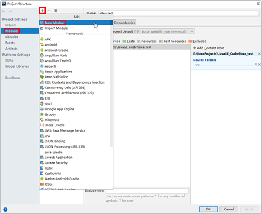

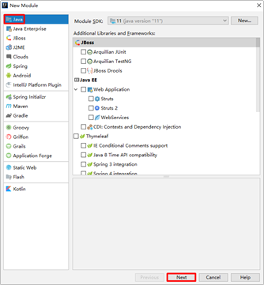

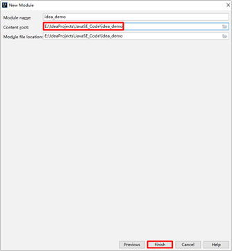

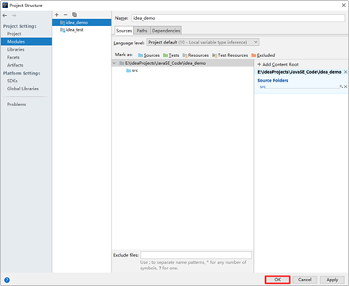

##### 1.9.7.2 删除模块

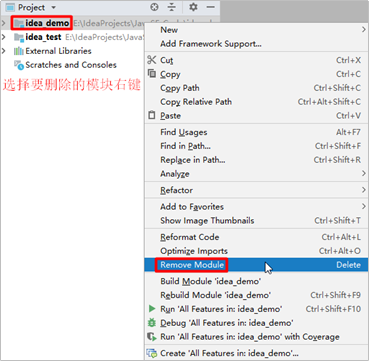

意思是移除指定模块，但没有文件被删除，就是说，模块移除了，磁盘上的文件还在


可以选中idea_test右键，然后选择Show in Explorer，这样可以快速打开模块所在位置。要想删除，可以在这里手动删除即可。


##### 1.9.7.3 导入模块


## 二、Java基础

### 2.1 HelloWorld

[程序练习](https://github.com/Nicolas-gaofeng/Salute_Java/blob/main/java_basic_01/first_java_01/HelloWorld.java)

HelloWorld案例是指在计算机屏幕上输出“HelloWorld”这行文字。各种计算机语言都习惯使用该案例作为第一个演示案例。

1、新建文本文档文件，修改名称为HelloWorld.java。
2、用记事本打开HelloWorld.java文件，输写程序内容。

```java
public class HelloWorld {
	public static void main(String[] args) {
		System.out.println("HelloWorld");
	}
}
```

HelloWorld案例的编译和运行

存文件，打开命令行窗口，将目录切换至java文件所在目录，编译java文件生成class文件，运行class文件。
编译：javac 文件名.java
范例：javac HelloWorld.java
执行：java 类名
范例：java HelloWorld


### 2.2 Bug

在电脑系统或程序中，隐藏着的一些未被发现的缺陷或问题统称为bug（漏洞）。

常见问题

1. 非法字符问题。Java中的符号都是`英文`格式的。
2. 大小写问题。Java语言对大小写敏感（区分大小写）。
3. 在系统中显示文件的扩展名，避免出现HelloWorld.java.txt文件。
4. 编译命令后的java文件名需要带文件后缀.java
5. 运行命令后的class文件名（类名）不带文件后缀.class
   ...

### 2.3 注释

[程序练习](https://github.com/Nicolas-gaofeng/Salute_Java/blob/main/java_basic_01/notes_java_03/notes_java.java)

注释是对代码的解释和说明文字，可以提高程序的可读性，因此在程序中添加必要的注释文字十分重要。

注释不参与程序运行，仅起到说明作用

Java中注释分为三种：

1. `单行注释`

   单行注释的格式是使用//，从//开始至本行结尾的文字将作为注释文字。

```java
// 这是单行注释文字
```

2. `多行注释`

   多行注释的格式是使用/* 和 */将一段较长的注释括起来。

```java
/*
这是多行注释文字
这是多行注释文字
这是多行注释文字
*/
注意：多行注释不能嵌套使用。
```

3. `文档注释`

   文档注释以/** 开始，以 */ 结束。

### 2.4 命名规则

#### 2.4.1 关键字

- 关键字是指被java语言赋予了特殊含义的单词。

- 关键字的特点：
  - 关键字的字母全部小写。

  - 常用的代码编辑器对关键字都有高亮显示，比如现在我们能看到的public、class、static等。

    

#### 2.4.2 标识符命名规范

标识符是用户编程时使用的名字，用于给类、方法、变量、常量等命名。
Java中标识符的组成规则：由字母、数字、下划线"_"、美元符号"$"组成

- 第一个字符不能是数字。
- 不能使用java中的关键字作为标识符。
- 标识符对大小写敏感（区分大小写）。

标识符的命名最好可以做到见名知意，例如：userName、studentNumber等

- 小驼峰式命名：（方法、变量）

  约定1：标识符是一个单词的时候，首字母小写

  范例1：name

  约定2：标识符由多个单词组成的时候，第一个单词首字母小写，其他单词首字母大写

  范例2：firstName

- 大驼峰式命名：（类名）

  约定1：标识符是一个单词的时候，首字母大写

  范例1：Student每个单词的首字母都大写。

  约定2：标识符由多个单词组成的时候，每个单词的首字母大写

  范例2：GoodStudent

### 2.5 数据类型

Java是一个强类型语言，Java中的数据必须明确数据类型，不同的数据类型也分配了不同的内存空间，所以它们表示的数据大小也是不一样的。

在Java中的数据类型包括基本数据类型和引用数据类型两种。


#### 2.5.1 基本数据类型

#### 2.5.2 引用数据类型

#### 2.5.3 数据类型内存占用和取值范围

| 数据类型 |    关键字    | 内存占用 |           取值范围            |
| :------: | :----------: | :------: | :---------------------------: |
|   整数   |     byte     |    1     |           -128~127            |
|          |    short     |    2     |         -32768~32767          |
|          |  int(默认)   |    4     |    -2的31次方到2的31次方-1    |
|          |     long     |    8     |    -2的63次方到2的63次方-1    |
|  浮点数  |    float     |    4     |  1.401298e-45到3.402823e+38   |
|          | double(默认) |    8     | 4.9000000e-324到1.797693e+308 |
|   字符   |     char     |    2     |            0-65535            |
|   布尔   |   boolean    |    1     |          true，false          |

说明：e+38表示是乘以10的38次方，同样，e-45表示乘以10的负45次方

在java中整数默认是int类型，浮点数默认是double类型。

#### 2.5.4 类型转换

在Java中，一些数据类型之间是可以相互转换的。分为两种情况：自动类型转换和强制类型转换。

##### 2.5.4.1 自动类型转换

把一个表示数据范围小的数值或者变量赋值给另一个表示数据范围大的变量。这种转换方式是自动的，直接书写即可。例如：

```java
double num = 10; // 将int类型的10直接赋值给double类型
System.out.println(num); // 输出10.0
```


##### 2.5.4.2 强制类型转换

把一个表示数据范围大的数值或者变量赋值给另一个表示数据范围小的变量。
强制类型转换格式：目标数据类型 变量名 = (目标数据类型)值或者变量;

例如：

```java
范例：int k = (int)88.88;
double num1 = 5.5;
int num2 = (int) num1; // 将double类型的num1强制转换为int类型
System.out.println(num2); // 输出5（小数位直接舍弃）
```

说明：

1. char类型的数据转换为int类型是按照码表中对应的int值进行计算的。比如在ASCII码表中，'a'对应97。

   ```java
   int a = 'a';
   System.out.println(a); // 将输出97
   ```

2. 整数默认是int类型，byte、short和char类型数据参与运算均会自动转换为int类型。

```java
byte b1 = 10;
byte b2 = 20;
byte b3 = b1 + b2;
// 第三行代码会报错，b1和b2会自动转换为int类型，计算结果为int，int赋值给byte需要强制类型转换。
// 修改为:
int num = b1 + b2;
// 或者：
byte b3 = (byte) (b1 + b2);
```

3. boolean类型不能与其他基本数据类型相互转换。

### 2.6 常量

[程序练习](https://github.com/Nicolas-gaofeng/Salute_Java/blob/main/java_basic_01/constant_java_04/ConstantDemo.java)

在日常生活中，我们通常都用3.14代表圆周率去进行近似计算。只要用到圆周率的地方，我们使用的都是3.14，也就是说，这个值是固定不变的，这样的值就是我们说的常量。

定义：在程序运行过程中，其值不可以发生改变的量。


|  常量类型  |         说明         |            举例            |
| :--------: | :------------------: | :------------------------: |
| 字符串常量 | 用双引号括起来的内容 | “HelloWorld”，“黑马程序员” |
|  整数常量  |    不带小数的数字    |          666，-88          |
|  小数常量  |     带小数的数字     |        13.14，-5.21        |
|  字符常量  | 用单引号括起来的内容 |      ‘A’，‘0’， ‘我’       |
|  布尔常量  |   布尔值，表示真假   |  只有两个值：true，false   |
|   空常量   |  一个特殊的值，空值  |         值是：null         |

空常量是不能直接进行输出的

### 2.7 变量

[程序练习](https://github.com/Nicolas-gaofeng/Salute_Java/blob/main/java_basic_01/variable_java_05/VariableDemo01.java)

#### 2.7.1 变量的定义

变量：在程序运行过程中，其值可以发生改变的量。
从本质上讲，变量是内存中的一小块区域，其值可以在一定范围内变化。
变量的定义格式：

```java
数据类型 变量名 = 初始化值; // 声明变量并赋值
int age = 18;
System.out.println(age);
```

或者

```java
// 先声明，后赋值（使用前赋值即可）
数据类型 变量名;
变量名 = 初始化值;
double money;
money = 55.5;
System.out.println(money);
```

还可以在同一行定义多个同一种数据类型的变量，中间使用逗号隔开。但不建议使用这种方式，降低程序的可读性。

```java
int a = 10, b = 20; // 定义int类型的变量a和b，中间使用逗号隔开
System.out.println(a);
System.out.println(b);
int c,d; // 声明int类型的变量c和d，中间使用逗号隔开
c = 30;
d = 40;
System.out.println(c);
System.out.println(d);
```

#### 2.7.2 变量的使用

变量的使用：通过变量名访问即可。

```java
取值格式：变量名
范例：a
修改值格式：变量名 = 变量值;
范例：a = 20;
```

注意事项

1. 在同一对花括号中，变量名不能重复。
2. 变量在使用之前，必须初始化（赋值）。
3. 定义long类型的变量时，需要在整数的后面加L（大小写均可，建议大写）。因为整数默认是int类型，整数太大可能超出int范围。
4. 定义float类型的变量时，需要在小数的后面加F（大小写均可，建议大写）。因为浮点数的默认类型是double， double的取值范围是大于float的，类型不兼容。


运算符

流程控制

方法的定义、调用、重载

数组

## 三、面向对象

面向对象
